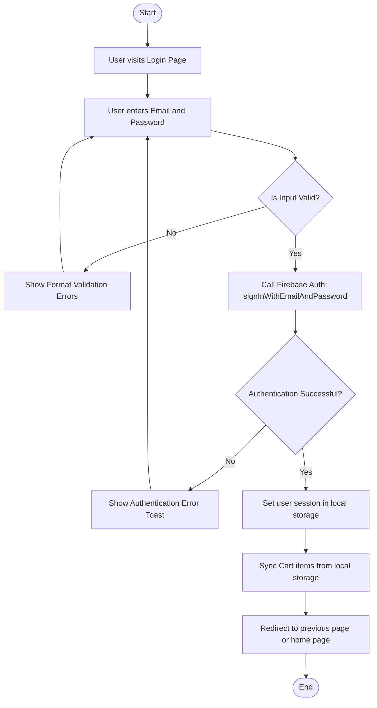
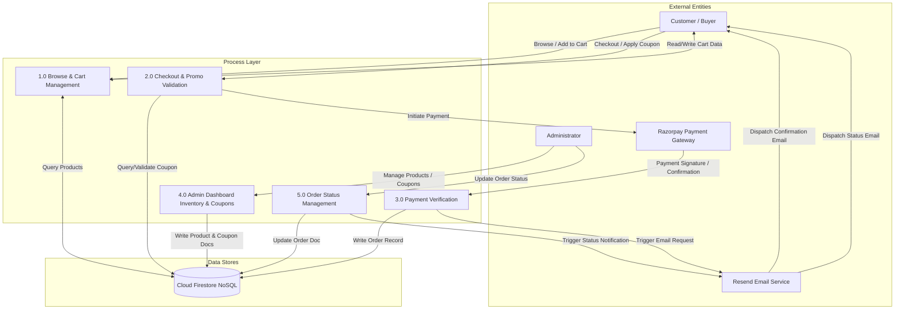
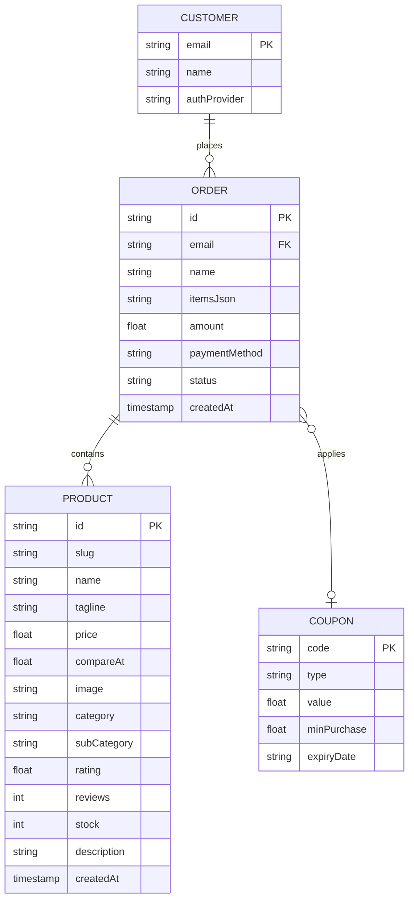

# Project Documentation & System Design Report: Saanjh

Welcome to the comprehensive project documentation for **Saanjh**, a premium e-commerce platform specializing in luxury lifestyle items, featuring a curated catalog focus on luxury hand-poured candles and fine jewelry. This document outlines the architectural specifications, technology choices, system diagrams, data structures, and implementation methodologies of the web application.

---

## 1. Introduction

### 1.1 Project Overview
Saanjh is a premium, full-stack e-commerce web application engineered for luxury lifestyle retail. The platform provides clients with an immersive shopping experience featuring a hybrid catalog of artisanal, hand-poured candles (featuring premium soy and coconut wax, natural essential oils, dried flowers, raw crystals, and festive shapes) alongside exquisite, fine jewelry collections (featuring gold-plated necklaces, freshwater pearl earrings, stacked eternity rings, and cuff bracelets).

The application provides a responsive design, interactive wishlist and cart systems, automated coupon discount applications, and a secure online payment portal. On the operations side, it equips administrators with a secure admin dashboard to control product catalogs, configure discount coupon rules, and track or update customer orders in real-time.

### 1.2 Purpose and Objectives
The main objectives of this system include:
*   **Immersive Dual-Storefront**: Showcasing premium candles and fine jewelry with modern typography, smooth animations, and high-quality image galleries.
*   **Secure Authentication**: Protecting user and administrator accounts via Firebase Authentication.
*   **Automated Promo Code Engine**: Verifying coupon validity, checking minimum purchase requirements, calculating discount amounts, and enforcing expiry dates in real time.
*   **Secure Payment Funnel**: Integrating standard Razorpay checkout workflows, verifying payment signatures server-side, and providing clear success pages.
*   **Real-time Synchronization**: Using NoSQL Cloud Firestore to instantly propagate order status modifications from the admin console to the customer's portal.
*   **Transactional Notifications**: Utilizing the Resend API to dispatch automated confirmation emails for successful orders and notification alerts for failed payments.

### 1.3 Features of the System

#### 1.3.1 Customer Features
*   **User Registration**: Allows new customers to register accounts securely.
*   **User Login**: Restricts access to sensitive shopping flows using secure credentials.
*   **Product Search**: Empowers users to search for candles and jewelry dynamically.
*   **Product Categories**: Filters products by category (candles and jewelry).
*   **Product Details**: Displays comprehensive details, burn times, wax types, materials, ratings, and reviews.
*   **Shopping Cart**: Monitors selected items, quantities, and variations inside a dynamic side-drawer.
*   **Order Placement**: Finalizes user selections, calculates discounts, and handles Razorpay checkout transitions.
*   **Order Tracking**: Connects orders directly to database status updates.
*   **Order History**: Logs previous purchases for user tracking and validation.
*   **Profile Management**: Stores user configuration states, logins, and settings.
*   **Wishlist Functionality**: Allows users to save favorite items for future shopping sessions.

#### 1.3.2 Admin Features
*   **View Orders**: Monitors active transactions and checkout logs.
*   **Update Order Status**: Uses a dynamic dropdown to update order fulfillment states (Processing, Shipped, Delivered) directly in the database.
*   **Revenue Monitoring**: Tracks total revenues and checkout metrics.
*   **User Analytics**: Evaluates user signups and catalog interactions.
*   **Dashboard Management**: Provides database catalog overrides to add, edit, or delete catalog items.

### 1.4 Advantages
*   **User Friendly Interface**: Uses a responsive flexbox layout, smooth animations, and clean typography.
*   **Cloud-Based Storage**: Retains dynamic inventory catalogs and customer orders on Cloud Firestore.
*   **Secure Authentication**: Manages registration profiles, logins, and passwords using Firebase Authentication.
*   **Easy Maintenance**: Relies on a modular React framework codebase structure.
*   **Scalable Architecture**: Connects serverless API endpoints using isomorphic handler integrations.
*   **Real-Time Data Synchronization**: Syncs admin catalog modifications and status updates with customer dashboards instantly.

### 1.5 Application Modules
The project consists of the following modules:
1.  **Authentication Module**: Manages logins, registrations, password recoveries, and active session tokens.
2.  **Home Module**: Banners, landing slides, featured items, and catalog entry links.
3.  **Product Management Module**: Catalogs, category selectors, and detail routes.
4.  **Cart Module**: Cart drawer additions, adjustments, and storage wipes.
5.  **Order Module**: Checkout summaries, coupon applications, payment processing, and order success screens.
6.  **Profile Module**: Orders lists and client logs.
7.  **Admin Module**: Administration hubs, products database CRUD dashboards, and coupons list forms.
8.  **Analytics Module**: Tracking panels and status dropdown updates.
9.  **Notification Module**: Automated email delivery (success/failure logs) powered by the Resend mailing system.

---

## 2. Technologies Overview

Saanjh utilizes a modern, isomorphic full-stack development architecture designed for rapid load times, search engine optimization, and a premium user experience:

*   **Frontend Library**: **React 19** – Empowering interactive layouts with components, client-side rendering capabilities, and hooks.
*   **Framework**: **TanStack Start (React Start)** – A type-safe full-stack framework using TanStack Router for file-based routing and built-in server functions for backend APIs.
*   **Bundler & Dev Server**: **Vite 7** – Providing hot module replacement and optimized assets compiling.
*   **Styling**: **Tailwind CSS v4** – Implementing a cohesive spacing system, customized animations, typography, and responsive breakpoints.
*   **Database**: **Cloud Firestore (NoSQL)** – Storing products, coupons, and orders documents with millisecond retrieval and real-time triggers.
*   **Authentication**: **Firebase Authentication** – Handling user credentials, credentials validation, and admin sessions securely.
*   **Payment Gateway**: **Razorpay API** – Integrating card, UPI, net banking, and wallet transactions through the Razorpay standard overlay frame.
*   **Mailing System**: **Resend API** – Dispatched via server functions for sending formatted transactional emails.

---

## 3. Hardware and Software Specification

### 3.1 Hardware Specifications

#### 3.1.1 Development / Administrator Workstation
*   **Processor**: Intel Core i5/i7, AMD Ryzen 5/7, or Apple Silicon M-series.
*   **System RAM**: 8 GB minimum (16 GB recommended).
*   **Storage**: Solid State Drive with at least 5 GB of free space.
*   **Network**: Active broadband connection for database syncing and dependency downloads.

#### 3.1.2 Deployment Environment (Serverless & Hosting)
*   **Platform**: Firebase Hosting (CDN nodes for static files distribution).
*   **Compute**: Serverless cloud functions supporting Node.js runtime environments.

#### 3.1.3 End-User Client Devices
*   **Mobile Devices**: Smart devices running iOS 14 or higher, or Android 9 or higher, with modern web browsers.
*   **Desktop/Laptops**: Any standard PC running Windows, macOS, or Linux.

### 3.2 Software Specifications

#### 3.2.1 Development Tools
*   **Operating System**: Windows 10/11, macOS, or Linux.
*   **Runtime Environment**: Node.js version 18 or 20, or Bun.
*   **Integrated Development Environment (IDE)**: Visual Studio Code with TypeScript, ESLint, and Tailwind CSS extensions.
*   **Version Control**: Git.

#### 3.2.2 End-User Software
*   **Supported Browsers**: Google Chrome (version 90 or higher), Apple Safari (version 14 or higher), Mozilla Firefox (version 88 or higher), Microsoft Edge (version 90 or higher).

---

## 4. Web Application

Saanjh is designed as a full-featured single-page application with server-side pre-rendering. This architecture divides the platform into four primary logical subsystems:

```
                  ┌───────────────────────────────┐
                  │        Saanjh Web App         │
                  └───────────────┬───────────────┘
                                  │
      ┌──────────────────┬────────┴─────────┬──────────────────┐
      ▼                  ▼                  ▼                  ▼
┌───────────┐      ┌───────────┐      ┌───────────┐      ┌───────────┐
│Storefront │      │  Cart &   │      │   Admin   │      │Customer   │
│Catalog    │      │ Checkout  │      │Dashboard  │      │Orders     │
└───────────┘      └───────────┘      └───────────┘      └───────────┘
```

1.  **Storefront Catalog**: Displays categories divided dynamically by catalog sections:
    *   **Candles**: Scented, Soy, Luxury Urli, Jar, Decorative, Festival Specials (such as Modak, Ladoo, Katli shapes), and Aromatherapy.
    *   **Jewelry**: Rings, Necklaces, Earrings, and Bracelets.
2.  **Cart & Checkout Module**: Restricts additions to authenticated clients, monitors item counts, verifies promo codes against database values, handles Razorpay payment modals, and processes orders.
3.  **Admin Dashboard Portal**: Locked behind administrator credentials, providing catalog updates, creation of percentage or flat-rate coupon rules, and tracking of customer transactions.
4.  **Customer Orders Section**: A designated user workspace that reads order histories from the database, showcasing tracking statuses that update instantly.

---

## 5. Frontend and Backend Detail

### 5.1 Frontend Architecture
The frontend utilizes a modular file-based route structure powered by TanStack Router:

*   **Public Storefront Pages**:
    *   Storefront Home Page – Landing page showcasing candlelight and luxury jewelry banners, collections, and top products.
    *   Shop Page – Catalog view with dynamic filtering (Category: Candles vs. Jewelry) and sidebar search controls.
    *   Product Detail Page – Isomorphic detail page rendering candle or jewelry images, specifications (such as wax and scent profile for candles, or material and size specifications for jewelry), stock levels, reviews, and variants.
*   **Authentication Portals**:
    *   User Login and Registration Pages – Authentication portal for clients.
    *   Password Recovery Page – Verification reset interface.
*   **Customer Workspace Portals**:
    *   Checkout Portal – Form for entering shipment addresses, email destinations, applying coupon codes, and triggering payment gateways.
    *   Order Success Page – Receipt page displaying payment identifiers, transaction totals, and shopping navigation.
    *   My Orders Portal – Tracking table showing recent purchases.
*   **Admin Dashboard Portals**:
    *   Admin Entry Page – Overview dashboard with access credentials control.
    *   Admin Inventory Manager – Inventory manager displaying products with tools to create, edit, or delete items.
    *   Admin Coupons Portal – Promo code panel for adding or removing discounts.
    *   Admin Orders Dashboard – Client order portal containing progress dropdown elements.

### 5.2 Backend Architecture & Isomorphic API Strategy
To accommodate serverless static hosting without crashing on route transitions, APIs are written as Isomorphic Handlers:

*   **Client Mode (Browser execution)**: Operations are performed directly against Firebase services (Authentication and Firestore) using client SDK instances.
*   **Server Mode (Static pre-rendering)**: During initial page generation or server-side pre-compilation, the routes execute server-side endpoints using TanStack Start's server function handlers.
*   **Server-Side Security**: Credentials like Razorpay API keys, Razorpay secrets, and Resend authorization tokens are locked on the backend serverless engine and never exposed to client browsers.

---

## 6. Development Tool Kit

The project utilizes the following tooling suite to maintain code quality and build efficiency:

*   **Vite 7**: Handles script bundling, stylesheet preprocessing, and environment variable injections.
*   **ESLint**: Enforces code style rules and prevents potential bugs in React component hooks.
*   **Prettier**: Handles automatic code formatting.
*   **Tailwind CSS Compiler**: Compiles clean utility classes into optimized CSS stylesheets.
*   **Zod Schema Validator**: Validates payloads for server functions, checking client input parameters before sending queries to external endpoints.

---

## 7. Database

The database layer utilizes Cloud Firestore, a NoSQL document-based database. The data architecture is structured around three primary collections:

```
 ┌──────────────────────┐      ┌──────────────────────┐      ┌──────────────────────┐
  │    "products"        │      │     "coupons"        │      │      "orders"        │
  ├──────────────────────┤      ├──────────────────────┤      ├──────────────────────┤
  │ - id (String, PK)    │      │ - code (String, PK)  │      │ - id (String, PK)    │
  │ - slug (String)      │      │ - type (String)      │      │ - email (String)     │
  │ - name (String)      │      │ - value (Number)     │      │ - name (String)      │
  │ - price (Number)     │      │ - minPurchase (Num)  │      │ - items (Array)      │
  │ - category (String)  │      │ - expiryDate (String)│      │ - amount (Number)    │
  │ - stock (Number)     │      └──────────────────────┘      │ - status (String)    │
  │ - description (String)│                                   │ - createdAt (Number) │
  └──────────────────────┘                                    └──────────────────────┘
```

### 7.1 Database Security Architecture
Security configurations in the Firebase rules restrict data modification:
*   **Products & Coupons Collections**: Read access is allowed globally so all storefront shoppers can view catalogs and validate coupons. Write permissions are restricted to authenticated admin accounts.
*   **Orders Collection**: Customers can register new orders during checkout. Read operations are restricted to admin users or clients matching the order's owner identity.

---

## 8. System Analysis

### 8.1 Functional Requirements
*   **Catalog Seeding**: On initial startup, the database checks the products collection. If it is empty, it automatically seeds it with the initial product catalog (comprising premium soy/gel candles and fine jewelry pieces).
*   **Enforced Login**: Users must sign in to add products to the cart or wishlist. If no user session exists, the cart remains empty, and add triggers redirect the user to the login page with warning messages.
*   **Coupon Validation Engine**:
    *   Verifies that the entered coupon code exists and is active.
    *   Ensures the cart total meets the coupon's minimum purchase threshold.
    *   Enforces expiration limits using date-checking logic.
*   **Payment Verification**: The server verifies Razorpay signatures using HMAC-SHA256 cryptography verification before finalizing order creation.
*   **Live Status Updates**: Order statuses updated in the admin panel must immediately propagate to the client's orders page.

### 8.2 Non-Functional Requirements
*   **Performance**: The page compilation is optimized for load times under 2.0 seconds.
*   **Security**: Sensitive API tokens are kept server-side, and checkout inputs are validated with Zod.
*   **Usability**: The design utilizes custom fonts, clean transitions, and responsive grid layouts optimized for all device sizes.

---

## 9. Login Activity Diagram

This diagram displays the workflow when a client or administrator attempts to access their account:



---

## 10. Data Flow Diagram (DFD)

The Data Flow Diagram describes the progression of data throughout the platform, showing interactions between customers, administrators, and services:



---

## 11. ER-Diagram

The Entity-Relationship Diagram outlines the schema attributes and cardinalities of the NoSQL collections:



---

## 12. Testing

The platform was verified through structured validation test cases:

| Test ID | Module | Scenario | Input | Expected Outcome | Status |
| :--- | :--- | :--- | :--- | :--- | :--- |
| **TC-01** | Cart | Unauthenticated addition | Click Add to Cart while logged out | Blocks action, displays alert toast, and redirects user to login. | **Passed** |
| **TC-02** | Coupons | Invalid coupon check | Apply EXPIRED50 promo code | Validates date and displays error: "This coupon code has expired". | **Passed** |
| **TC-03** | Coupons | Purchase threshold validation | Apply MIN20 (Minimum limit: 1,000) on cart of 600 | Blocks coupon and displays error: "Minimum purchase threshold not met". | **Passed** |
| **TC-04** | Coupons | Successful application | Apply SAVE10 (10% discount) on cart of 1,000 | Pricing breakdown updates, showing 100 discount line-item and 900 subtotal. | **Passed** |
| **TC-05** | Checkout | Payment Modal Cancellation | Dismiss Razorpay interface | Closes payment popup safely and sends a payment failed or pending email alert. | **Passed** |
| **TC-06** | Checkout | Successful Verification | Complete payment on Razorpay | Verifies signature server-side, registers transaction, and redirects to success view. | **Passed** |
| **TC-07** | Admin | Real-time Status Sync | Update order status to Shipped in Admin | Modifies database value. Customer portal orders view updates instantly. | **Passed** |

---

## 13. Input / Output Screen

The application provides a premium user interface across all routes:

1.  **Storefront Catalog View**: Features category filters (Candles: Scented, Soy, Jar, Urli; Jewelry: Rings, Necklaces, Bracelets, Earrings), interactive cards with rating indicators, hover effects, and pricing badges.
2.  **Product Detail Page**: Displays image slides, product specifications (wax and scent highlights for candles, metals and dimensions for jewelry), pricing details, description tabs, and interactive options to adjust cart or wishlist items.
3.  **Shopping Cart Drawer**: Sliding overlay panel listing item quantities, wax, scent, or size selections, subtotal calculations, and checkout buttons.
4.  **Checkout Interface**: Contains input fields for shipping details, email destinations, a coupon code validator box, and a payment breakdown container.
5.  **Razorpay Payment Portal**: Secure system overlay displaying payment options (UPI, Card, Net Banking) matching Razorpay's standard checkout design.
6.  **Order Success Page**: Page containing a payment success badge, transactional reference IDs, confirmation totals, and home navigation controls.
7.  **Customer Order Workspace**: Tracking interface grouping transactions by status (Processing, Shipped, Delivered) with reference details.
8.  **Admin Portal Panel**: Management console featuring interactive inventory tables, product creator cards, and real-time coupon lists.

---

## 14. List of Data Table
The data structures of the NoSQL collections are outlined below:

### 14.1 Products Collection (products)

| Field | Data Type |
| :--- | :--- |
| id | String |
| slug | String |
| name | String |
| tagline | String |
| price | Integer |
| compareAt | Integer |
| image | String |
| gallery | Array |
| category | String |
| subCategory | String |
| rating | Integer |
| reviews | Integer |
| stock | Integer |
| description | String |
| createdAt | Integer |

### 14.2 Coupons Collection (coupons)

| Field | Data Type |
| :--- | :--- |
| code | String |
| type | String |
| value | Integer |
| minPurchase | Integer |
| expiryDate | String |

### 14.3 Orders Collection (orders)

| Field | Data Type |
| :--- | :--- |
| id | String |
| name | String |
| email | String |
| amount | Integer |
| status | String |
| paymentMethod | String |
| items | Array |
| phone | String |
| gstin | String |
| shippingAddress | Object |
| createdAt | Integer |

---

## 15. Future Scope

Planned enhancements for the system include:
*   **Multi-Currency Support**: Automated conversion rates displaying local currencies based on client geolocations.
*   **Review Management Portal**: Allowing customers to upload media attachments and reviews directly on product pages.
*   **SMS Updates**: Integrating Twilio SMS workflows to send tracking updates directly to customers' mobile devices.
*   **Loyalty & Reward Programs**: Allowing customers to accrue points on purchases that translate to custom checkout discount codes.
*   **Smart Inventory Notifications**: Automated email notifications sent to administrators when stock levels for a product drop below a specified threshold.

---

## 16. Conclusion

The **Saanjh** e-commerce platform successfully combines a modern React application layout with cloud-based serverless resources. By migrating database queries to Cloud Firestore and utilizing isomorphic handlers, the site balances fast initial server loads with instant client updates. Advanced checkout integrations—including dynamic coupon checks, Razorpay validation, and automated Resend mailing systems—provide customers and administrators with a reliable, full-featured web experience that seamlessly supports both home aromatherapy and elegant accessories.

---

## 17. Bibliography / References

*   **React 19 Documentation**: [https://react.dev](https://react.dev)
*   **Vite Developer Guide**: [https://vite.dev](https://vite.dev)
*   **TanStack Router & Start Documentation**: [https://tanstack.com/router/latest](https://tanstack.com/router/latest)
*   **Tailwind CSS CSS-First Configuration**: [https://tailwindcss.com](https://tailwindcss.com)
*   **Firebase SDK Integration Manual**: [https://firebase.google.com/docs](https://firebase.google.com/docs)
*   **Razorpay standard checkout integration specifications**: [https://razorpay.com/docs/payments/payment-gateway](https://razorpay.com/docs/payments/payment-gateway)
*   **Resend Email Developers Guide**: [https://resend.com/docs](https://resend.com/docs)
*   **Mermaid Flowchart Syntax Guidelines**: [https://mermaid.js.org](https://mermaid.js.org)
